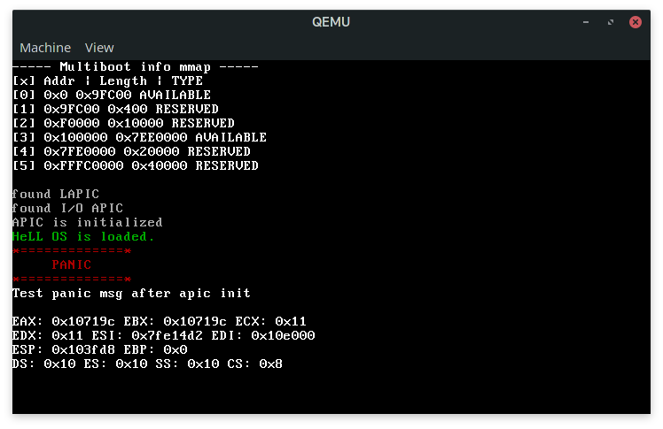
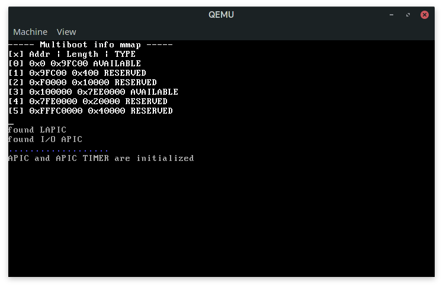

# Low Level Programming course | DIHT term 5
AIM: build small x86 operating system

### Developed:
+ Terminal output moved into stdlib dir
+ Primitive printf
+ Kernel panic
+ ACPI: rsdp & rsdt validation
+ Mem map from multiboot into
+ APIC timer callibration

### Build:
Regular `make` build system

